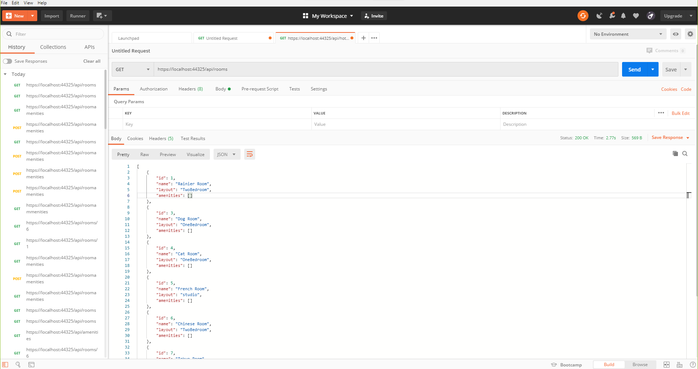
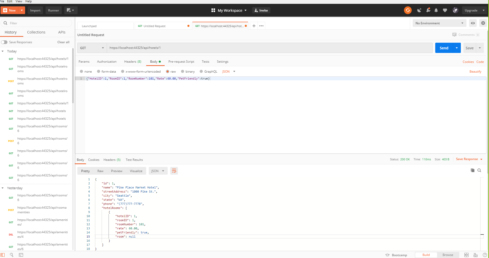
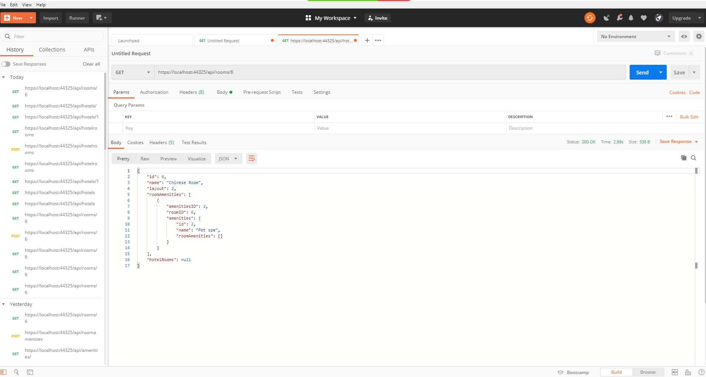
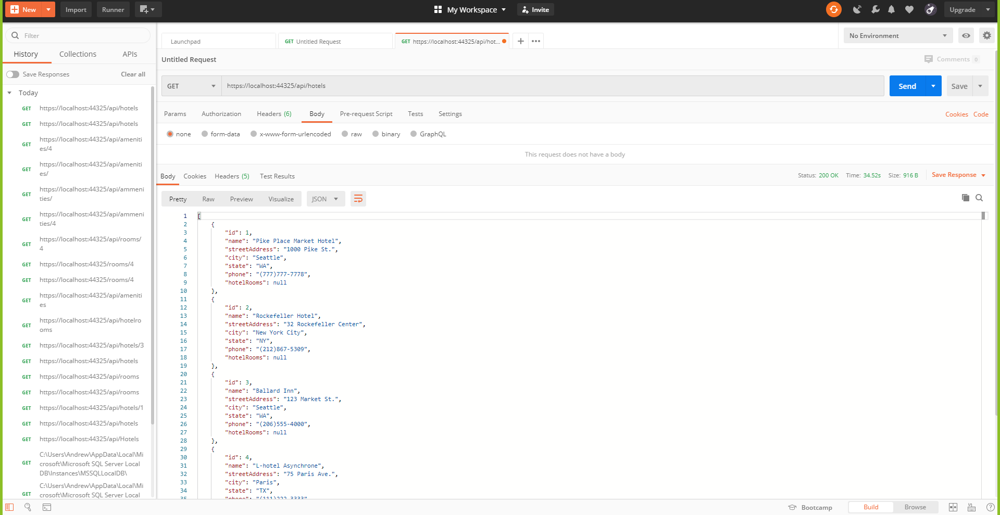

# Lab13-Async-Inn
*API Server for a Hotel Asset Management System*  
*by Andrew Casper and Harry Cogswell | April 7th, 2020*

## Description
An API Server developed for the Async Inn, which can return various information from a database of the Inn's locations, room layouts, and amenities. This API Server is still in development, and not readily available to the public, however, if you would like to test out our end points in the server's current state, simply clone this repo on to your local machine, and follow [these](#Directions) instructions:

> *Server testing using Postman*
#### Lab 17

#### Lab 16

#### Lab 14

### Directions
- Open [Visual Studio](https://visualstudio.microsoft.com/downloads/), open the `\AsyncInn\AsyncInn.sln` file in this repo.
- To populate a local database you can test the end points on, open your Nuget Package Manager Console, from the tools menu.
- In this console, type in `add-migration YourMigrationName`
- after the new migration is completed, type in `update-database` to provide your database with some seed data.
- From there, run the program, either by:
    - pressing the green arrow with "AsyncInn" next to it
    - opening the debug menu and selecting "Start Debugging"
    - pressing `f5` on your keyboard
- After a little processing, your browser should load up an empty page, with the url LocalHost:#####. To see various endpoints and explore our API's functionality, add any of these different urls to the end of your local host number:
    - `api/hotels`
    - `api/rooms`
    - `api/amenities`  
- You can also provide a `/#` to the end of any of these to bring up an entry of a specific ID number

### Tables and Entity Relationships

> *Diagram of our Entities and their relationships*
 

- __Hotel__ has all the information for each hotel location. This includes an ID as its integer *primary key*, the Name of the location, the city, state, and address of location, as well as a phone number, all of which are nvarchars. It also references the HotelRoom table as a navigation property.
- __Room__ has the information for the different room designs, with an integer *primary key* ID, a Name nvarchar to represent the each nickname, and an int enum layout which distinguishes between a studio, single bedroom, or double bedroom layout. This table also references the HotelRoom and RoomAmenities join tables as navigation properties.
- __Amenities__  is a table of offered amenities, it includes an integer *primary key* ID , as well as the name of the amenity as an nvarchar. It has a reference to the RoomAmenities table as a navigation property.
- __HotelRoom__ is a join table that has all the information about each individual room. It has a composite key of the HotelID from the Hotel table and a RoomNumber integer value. It also has the RoomID from the Room table as a foreign key. As payload values, it has the rate of the room as a decimal, and whether or not the room is pet-friendly as a bit. As navigation properties, it has the Room and Hotel tables.
- __RoomAmenities__ is the join table combining room designs and amenities. It has the AmenitiesID and RoomID values as composite and foreign keys, and navigation properties to the Amenities and Room tables.

### Relationships
- Our core tables are Hotel, Room, and Amenities. Those three tables are related to each other by our join tables, HotelRoom and RoomAmenities, and have navigation properties to those tables. The join tables use the primary keys from the three core tables as composite keys. They also have navigation links back to the core tables.

*AsyncInnAPI v0.3*
