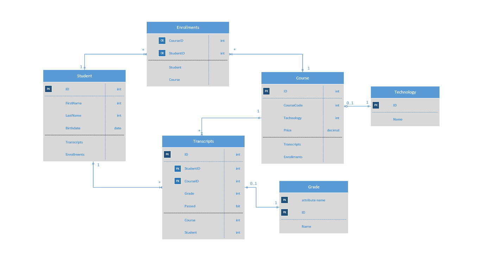

# Lab13-Async-Inn
API Server for a Hotel Asset Management System
by Andrew Casper and Harry Cogswell
April 1st, 2020

## Description

### Tables
- __Locations__ has all the information for each hotel location. This includes a location ID, its *primary key*, the Name of the location, the city, state, and address, as well as a phone number and the number of rooms it has.
- __Rooms__ has all the information about each individual room. This includes a *primary key* ID, the hotel location ID, the room number, its unique nickname, the room type, the amenities, and whether or not the room is pet-friendly.
- __Amenities__  is a table of our offered amenities, it includes a *primary key* ID , as well as a room type that it's used in.
- __RoomType__ is a table of our room layouts. It has a *primary key* ID, a room type, as well as a number of beds that defines the room type.
- __Pricing__ is based solely on the location and the room number. It has a price field to denote how much a room costs.

*AsyncInnAPI v0.2*
